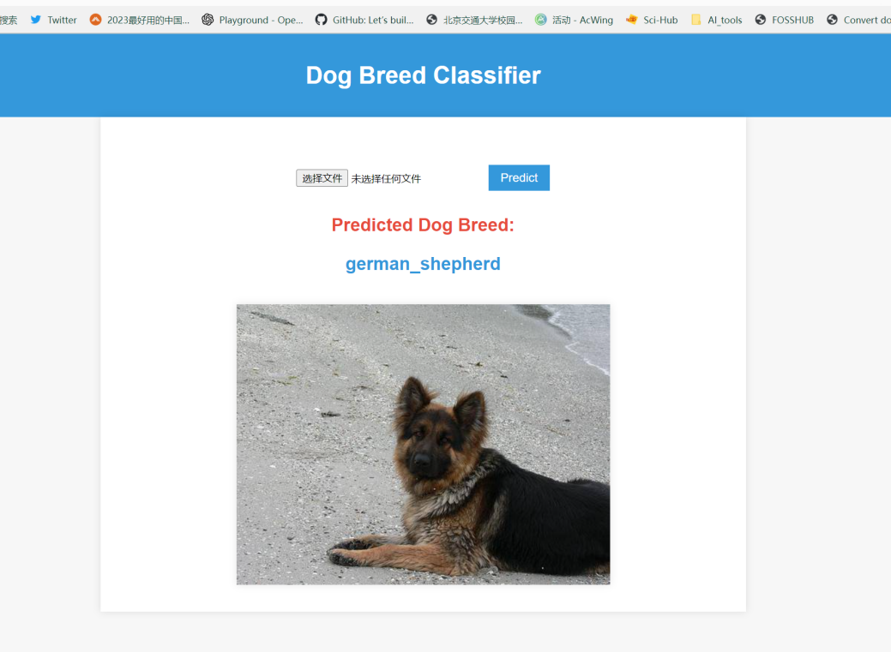
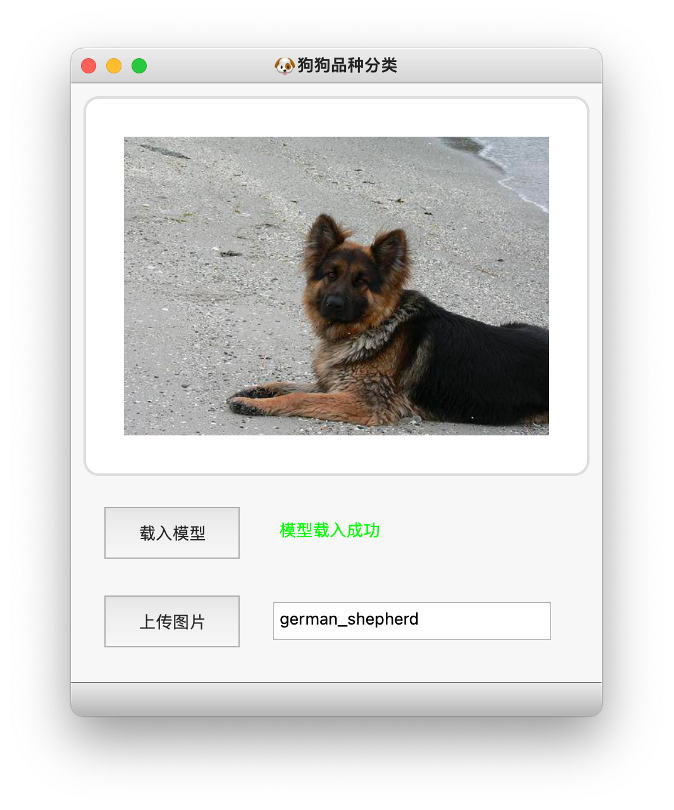

# Dog-Breed-Classify-Based-On-Mindspore-And-Pytorch

## preview

You can see your model result through your browser or an application.

### browser



### application



## run

You can train the model by running the code:

```python
cd mindspore
python train.py
```

or

```python
cd pytorch
python train.py
```

You can also see your result by application:

```python
cd app
python ui.py
```

or by browser:

```
cd web 
python main.py
```